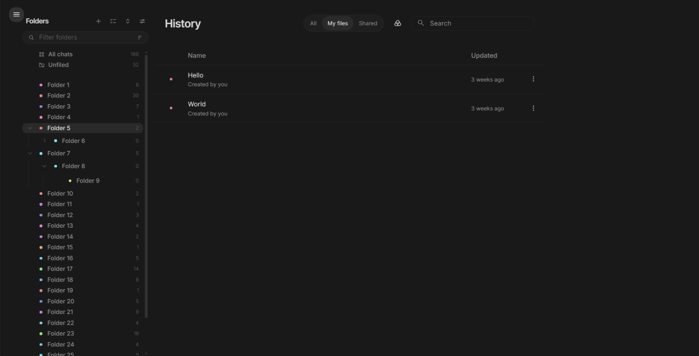

# AI Studio — Folders for History



A userscript that adds a folder tree to the history list in [Google AI Studio](https://aistudio.google.com), built to look like part of the app rather than something bolted onto it.

Folders nest as deep as you like, chats are filed by dragging or in bulk, and the whole hierarchy lives in your browser's `localStorage`. Nothing is sent anywhere — there is no server, no account, and no network access of any kind.

> **Unofficial.** Not affiliated with or endorsed by Google. It works by reading and restyling AI Studio's own page, so a redesign on their side can break it. See [Fragility](#fragility).

## Install

1. Install a userscript manager — [Tampermonkey](https://www.tampermonkey.net) or [Violentmonkey](https://violentmonkey.github.io).
2. Download `aistudio-folders.user.js` from the [latest release](../../releases/latest) and open it. Your manager will offer to install it.
3. Reload `aistudio.google.com`.

## What it does

**A folder rail** on the left of the history page. `All chats` and `Unfiled` are pinned at the top, above a divider — they are views rather than folders, so sorting and filtering never move or hide them.

**Filing chats.** Drag any chat onto a folder, or use the folder button at the start of its row to pick one. Dropping onto a collapsed folder expands it after a moment so you can aim at a child.

**Multi-select.** Toggle select mode to get checkboxes, then shift-click for a range. The action bar reports `N of M selected`, where M is the rows currently visible — so it tells you what a bulk action will actually touch, given the folder and filter you have applied. Select all, invert, move, and unfile all operate on that set.

**Finding a folder.** The filter box narrows the tree as you type, keeping a folder visible if it _or any descendant_ matches, so you never lose the path to a match. Sort A–Z or by chat count.

**Colours** are derived from the folder name, so a folder's colour is stable and reproducible rather than depending on the order you created things in. You can override any of them in the Folder Manager.

**Folder Manager** handles renaming, recolouring and deleting, and exports or imports the whole hierarchy as JSON. Deleting a folder unfiles its chats and reparents its children — it never deletes a chat.

### About the counts

Folder counts come from storage and are always exact.

`All chats` and `Unfiled` can only count rows AI Studio has actually rendered, and it loads history lazily as you scroll. Until the whole list has been walked those two are lower bounds, shown as `187+` rather than `187`. Use **Scan all
history** to walk it and drop the `+`.

## Privacy

Everything is stored under the `aisf.v2` key in `localStorage`, scoped to `aistudio.google.com`:

```json
{
  "v": 1,
  "folders": [
    {
      "id": "…",
      "name": "…",
      "parentId": null,
      "color": "#8ab4f8"
    }
  ],
  "items": {
    "<chatId>": {
      "f": "<folderId>"
    }
  },
  "ui": {
    "active": "all",
    "collapsed": {},
    "sort": "name"
  }
}
```

Only _filed_ chats get an `items` entry — an absent record means unfiled. Chat titles are never stored; earlier versions recorded them and are pruned on load.

The script declares `@grant none` and makes no requests. Clearing site data for `aistudio.google.com` erases your folders, so export a backup first if you care about them.

## Development

Requires [Bun](https://bun.com).

```bash
bun install
bun run check     # typecheck + lint, what CI gates on
bun run build     # bundle to dist/aistudio-folders.user.js
```

Everything lives in one file, [`src/index.ts`](src/index.ts): an IIFE that waits for AI Studio's history table to mount, injects the rail, and keeps rows in sync through a throttled `MutationObserver`.

Load `dist/aistudio-folders.user.js` into your userscript manager from disk to test a build, or point the manager at the file so it picks up rebuilds.

### The userscript banner

`src/index.ts` deliberately has **no** `==UserScript==` banner. The build minifies, which strips comments, so an inline banner would be silently dropped.
[`build.ts`](build.ts) prepends the real one and stamps `@version` and `@description` from `package.json`.

That makes `package.json` the single source of truth for the version, and the release workflow fails the build if a `v*` tag disagrees with it.

## Fragility

This script depends on AI Studio's internal markup — selectors like `ms-library-table section.lib-view`, `table.library-table tbody tr.mat-mdc-row` and `td.icon-cell`. None of that is a public API, and it can change without warning.

If the rail stops appearing or rows stop being decorated, that is the first thing to check. [CONTRIBUTING.md](CONTRIBUTING.md) explains how to compare against a live capture of the page.

## License

[MIT](LICENSE).
